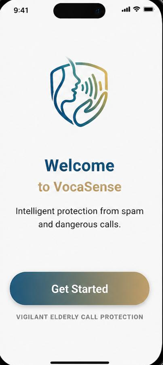
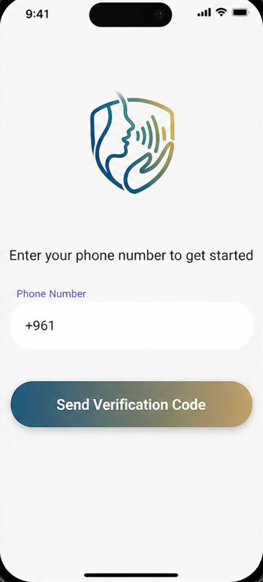
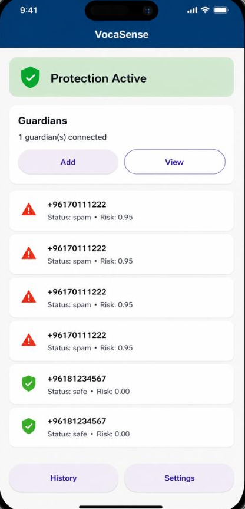

# VocaSense

VocaSense is a mobile scam call protection application designed to help elderly users identify and avoid suspicious phone calls. The app focuses on simple usability, real-time scam detection, and guardian alerts.

## Features

* Detects known spam numbers before the call is answered
* Uses Android Call Screening to identify and silence suspicious calls
* Analyzes call content using speech-to-text and scam keyword detection
* Calculates a risk score for suspicious conversations
* Sends guardian alerts when a call is flagged as risky
* Stores call history and reported spam numbers
* Supports secure phone-based login using Firebase Authentication
* Uses Firestore for storing user, guardian, and call-related data
* Provides a simple and accessible interface for elderly users

## Technologies Used

* Flutter
* Dart
* FastAPI
* Python
* Firebase Authentication
* Cloud Firestore
* REST APIs
* Android Call Screening Service

## Screenshots

<div align="center">

<table>
<tr>
<td></td>
<td></td>
<td></td>
</tr>
<tr>
<td align="center"><b>Welcome</b></td>
<td align="center"><b>Signup</b></td>
<td align="center"><b>Home</b></td>
</tr>
<tr>
<td></td>
<td></td>
<td></td>
</tr>
<tr>
<td align="center"><b>On Call</b></td>
<td align="center"><b>Listening</b></td>
<td align="center"><b>Spam Detected</b></td>
</tr>
</table>

</div>

## Project Structure

```text
VocaSense/
├── frontend/      # Flutter mobile application
├── backend/       # FastAPI backend services
├── screenshots/
└── README.md
```

## Backend Overview

The backend provides REST API endpoints for managing guardians, call history, spam reports, and alert notifications.

### Main backend responsibilities include:

* Saving reported spam numbers
* Retrieving call history
* Managing guardian contacts
* Sending guardian alerts
* Supporting communication between the mobile app and database

## Mobile App Overview

The Flutter app provides a simple interface for elderly users and integrates Android-specific services for scam call detection.

### Main app responsibilities include:

* User login and OTP verification
* Call detection and screening
* Scam warning display
* Guardian management
* Call history viewing
* Spam number reporting

## Purpose

This project was developed as a final year computer science project to address the growing issue of phone scams targeting elderly people. The goal is to provide a simple, practical, and accessible protection system that helps users stay safe while keeping trusted guardians informed.

## Author

Nada Itani
